# Microsoft SPARK - Implement Azure Arc-enabled data services

The following README will guide you on how to automatically deploy a sandbox environment for use with the Microsoft SPARK "Implement Azure Arc-enabled data services" training. In addition, the guide include the manual steps to deploy Azure Arc-enabled data services, which will be performed throughout the training.

By the end of the automated portion of this guide, you will have a vanilla Azure Kubernetes Service (AKS) cluster deployed alongside a Microsoft Windows Server 2022 (Datacenter) Azure VM, installed & pre-configured with all the required tools needed to work with Azure Arc-enabled data services.

## Prerequisites

- Clone the Azure Arc Jumpstart repository

    ```shell
    git clone https://github.com/microsoft/azure_arc.git
    ```

- [Install or update Azure CLI to version 2.25.0 and above](https://docs.microsoft.com/en-us/cli/azure/install-azure-cli?view=azure-cli-latest). Use the below command to check your current installed version.

  ```shell
  az --version
  ```

- [Generate SSH Key](https://docs.microsoft.com/en-us/azure/virtual-machines/linux/create-ssh-keys-detailed) (or use existing ssh key).

  ```shell
  ssh-keygen -t rsa -b 4096 -C "your_email@example.com"
  ```

- Create Azure service principal (SP). To deploy this scenario, an Azure service principal assigned with multiple RBAC roles is required:

  - "Contributor" - Required for provisioning Azure resources
  - "Security admin" - Required for installing Cloud Defender Azure-Arc enabled Kubernetes extension and dismiss alerts
  - "Security reader" - Required for being able to view Azure-Arc enabled Kubernetes Cloud Defender extension findings
  - "Monitoring Metrics Publisher" - Required for being Azure Arc-enabled data services billing, monitoring metrics, and logs management

    To create it login to your Azure account run the below command (this can also be done in [Azure Cloud Shell](https://shell.azure.com/).

    ```shell
    az login
    az ad sp create-for-rbac -n "<Unique SP Name>" --role "Contributor"
    az ad sp create-for-rbac -n "<Unique SP Name>" --role "Security admin"
    az ad sp create-for-rbac -n "<Unique SP Name>" --role "Security reader"
    az ad sp create-for-rbac -n "<Unique SP Name>" --role "Monitoring Metrics Publisher"
    ```

    For example:

    ```shell
    az ad sp create-for-rbac -n "JumpstartArcDataSvc" --role "Contributor"
    az ad sp create-for-rbac -n "JumpstartArcDataSvc" --role "Security admin"
    az ad sp create-for-rbac -n "JumpstartArcDataSvc" --role "Security reader"
    az ad sp create-for-rbac -n "JumpstartArcDataSvc" --role "Monitoring Metrics Publisher"
    ```

    Output should look like this:

    ```json
    {
    "appId": "XXXXXXXXXXXXXXXXXXXXXXXXXXXX",
    "displayName": "AzureArcData",
    "name": "http://AzureArcData",
    "password": "XXXXXXXXXXXXXXXXXXXXXXXXXXXX",
    "tenant": "XXXXXXXXXXXXXXXXXXXXXXXXXXXX"
    }
    ```

    > **NOTE: It is optional, but highly recommended, to scope the SP to a specific [Azure subscription](https://docs.microsoft.com/en-us/cli/azure/ad/sp?view=azure-cli-latest).**

## Automation Flow

For you to get familiar with the automation and deployment flow, below is an explanation.

- User is editing the ARM template parameters file (1-time edit). These parameters values are being used throughout the deployment.

- Main [_azuredeploy_ ARM template](https://github.com/likamrat/spark-arc-data-svc/blob/main/azuredeploy.json) will initiate the deployment of the linked ARM templates:

  - [_VNET_](https://github.com/likamrat/spark-arc-data-svc/blob/main/VNET.json) - Deploys a Virtual Network with a single subnet - used by our clientVM.
  - [_aks_](https://github.com/likamrat/spark-arc-data-svc/blob/main/aks.json) - Deploys the AKS cluster where all the Azure Arc data services will be deployed.
  - [_clientVm_](https://github.com/likamrat/spark-arc-data-svc/blob/main/clientVm.json) - Deploys the client Windows VM. This is where all user interactions with the environment are made from.
  - [_logAnalytics_](https://github.com/likamrat/spark-arc-data-svc/blob/main/logAnalytics.json) - Deploys Azure Log Analytics workspace to support Azure Arc-enabled data services logs uploads.

- User remotes into client Windows VM, which automatically kicks off the [_DataServicesLogonScript_](https://github.com/likamrat/spark-arc-data-svc/blob/main/artifacts/DataServicesLogonScript.ps1) PowerShell script that deploy and configure the rest of the environment.

## Deployment

As mentioned, this deployment will leverage ARM templates. You will deploy a single template that will initiate the entire automation for this scenario.

### Deployment Option 1: Azure portal

<!-- Click the <a href="https://portal.azure.com/#create/Microsoft.Template/uri/https%3A%2F%2Fraw.githubusercontent.com%2Flikamrat%2Fspark-arc-data-svc%2Fmain%2Fazuredeploy.json" target="_blank"></a> button and enter values for the the ARM template parameters. -->

[](https://portal.azure.com/#create/Microsoft.Template/uri/https%3A%2F%2Fraw.githubusercontent.com%2Flikamrat%2Fspark-arc-data-svc%2Fmain%2Fazuredeploy.json)


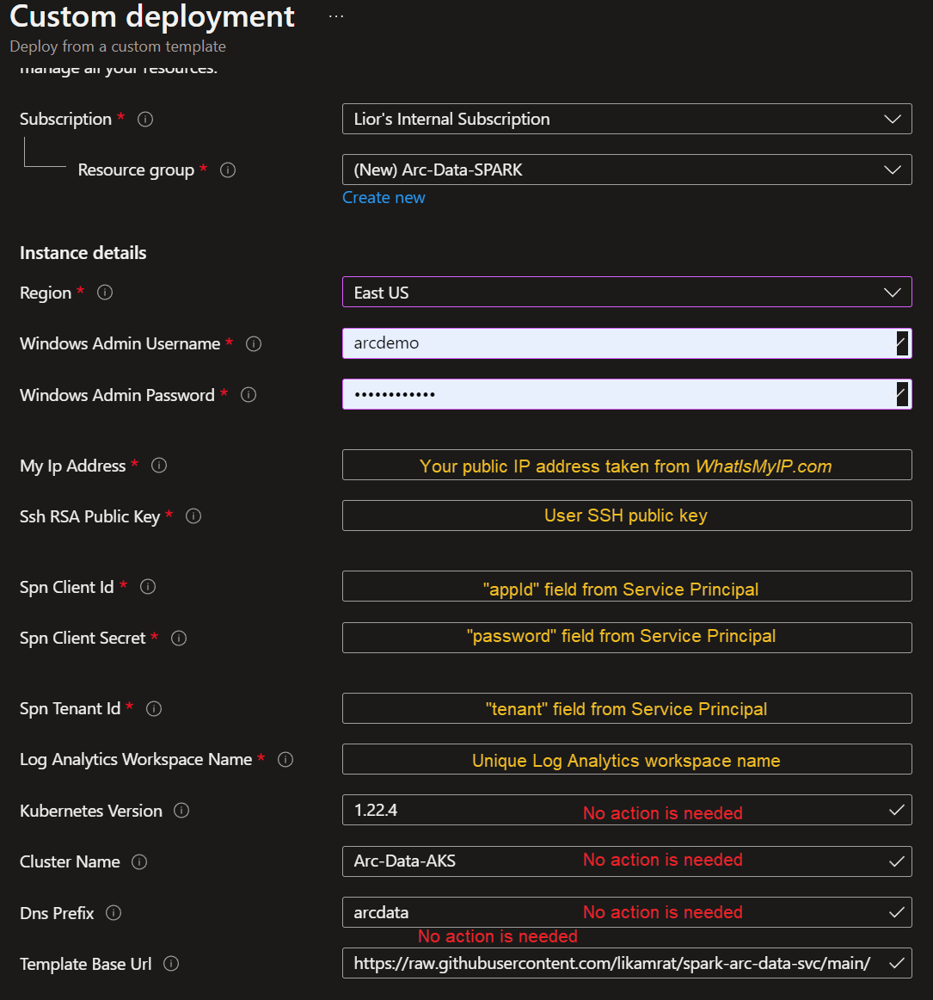

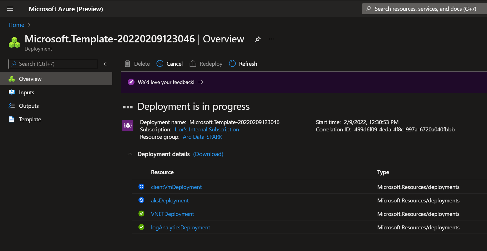

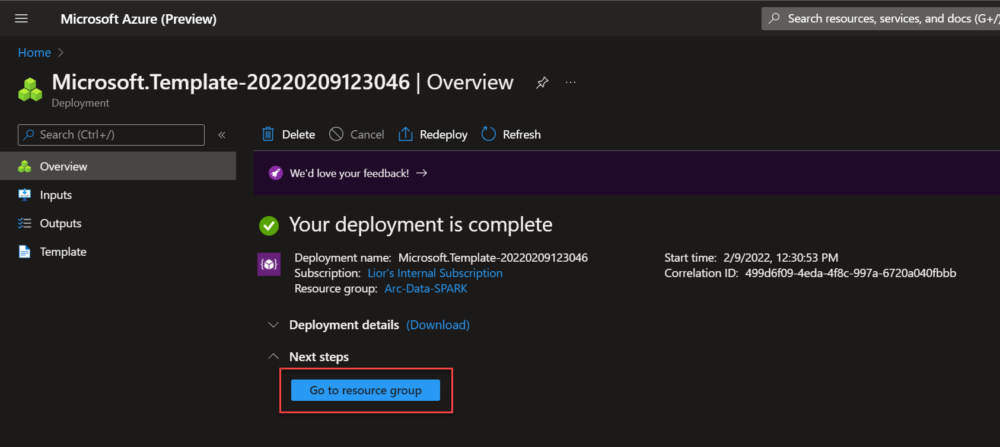

### Deployment Option 2: ARM template with Azure CLI

> **NOTE: Do not use Azure Cloud Shell for this deployment option as it relies on your local public IP address.**

- Clone the SPARK workshop GitHub repository

    ```shell
    git clone https://github.com/likamrat/spark-arc-data-svc.git
    ```

- The deployment is using the ARM template parameters file. Before initiating the deployment, edit the [_azuredeploy.parameters.json_](https://github.com/likamrat/spark-arc-data-svc/blob/main/azuredeploy.json) file located in your local cloned repository folder.

  - `sshRSAPublicKey` - Your SSH public key
  - `spnClientId` - Your Azure service principal id
  - `spnClientSecret` - Your Azure service principal secret
  - `spnTenantId` - Your Azure tenant id
  - `windowsAdminUsername` - Client Windows VM Administrator name
  - `windowsAdminPassword` - Client Windows VM Password. Password must have 3 of the following: 1 lower case character, 1 upper case character, 1 number, and 1 special character. The value must be between 12 and 123 characters long.
  - `myIpAddress` - Your local public IP address. This is used to allow remote RDP and SSH connections to the client Windows VM and AKS cluster. If you don't know your public IP, you can find it [here](https://www.whatismyip.com/).
  - `logAnalyticsWorkspaceName` - Unique name for the deployment log analytics workspace.

- To deploy the ARM template, navigate to the local cloned [deployment folder](https://github.com/likamrat/spark-arc-data-svc) and run the below command:

    ```shell
    az group create --name <Name of the Azure resource group> --location <Azure Region>
    az deployment group create \
    --resource-group <Name of the Azure resource group> \
    --name <The name of this deployment> \
    --template-uri https://raw.githubusercontent.com/likamrat/spark-arc-data-svc/main/azuredeploy.json \
    --parameters <The *azuredeploy.parameters.json* parameters file location>
    ```

    > **NOTE: Make sure that you are using the same Azure resource group name as the one you've just used in the _azuredeploy.parameters.json_ file**

    For example:

    ```shell
    az group create --name Arc-Data-SPARK --location "East US"
    az deployment group create \
    --resource-group Arc-Data-SPARK \
    --name arcdata \
    --template-uri https://raw.githubusercontent.com/likamrat/spark-arc-data-svc/main/azuredeploy.json \
    --parameters azuredeploy.parameters.json
    ```

    > **NOTE: The deployment time for this scenario can take ~15-20min**

- Once Azure resources has been provisioned, you will be able to see it in Azure portal. At this point, the resource group should have 8 various Azure resources deployed.

    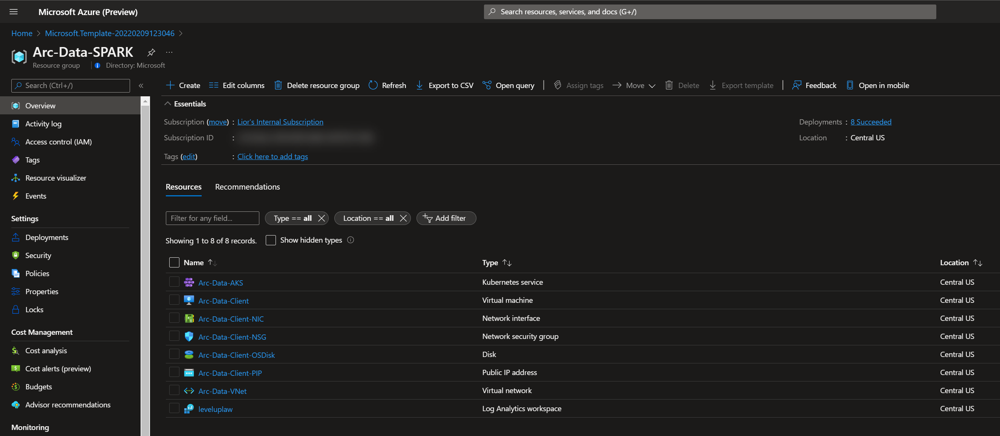

### Windows Login & Post Deployment

- Now that first phase of the automation is completed, it is time to RDP to the _Arc-Data-Client_ virtual machine using it's public IP.

    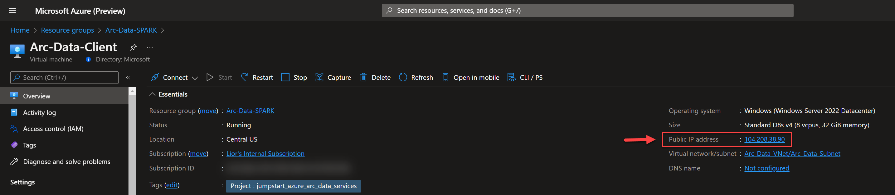

    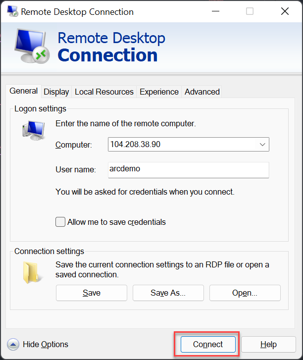

- Let the script to run its course and do not close the PowerShell session, this will be done for you once completed. Once the script will finish it's run, the logon script PowerShell session will be closed and the Windows wallpaper will change.

    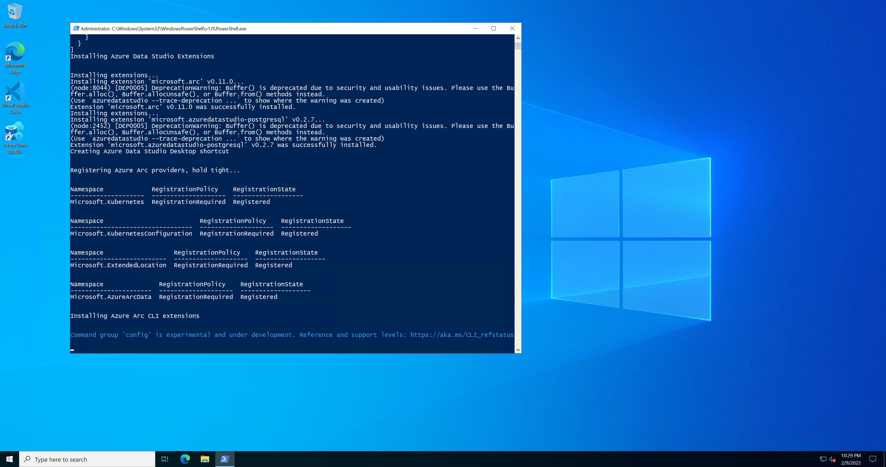

    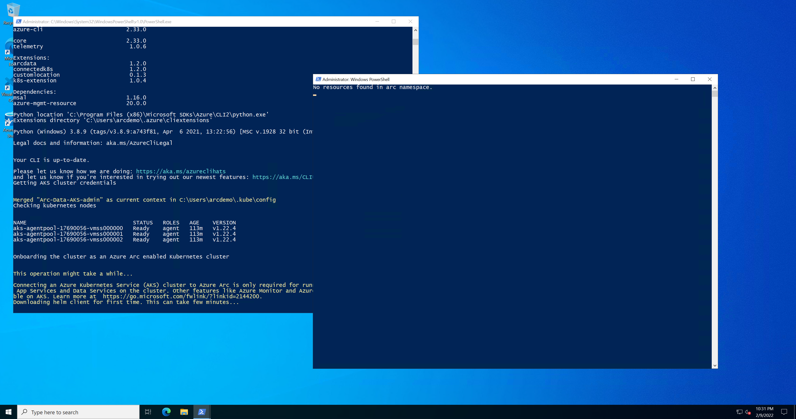

    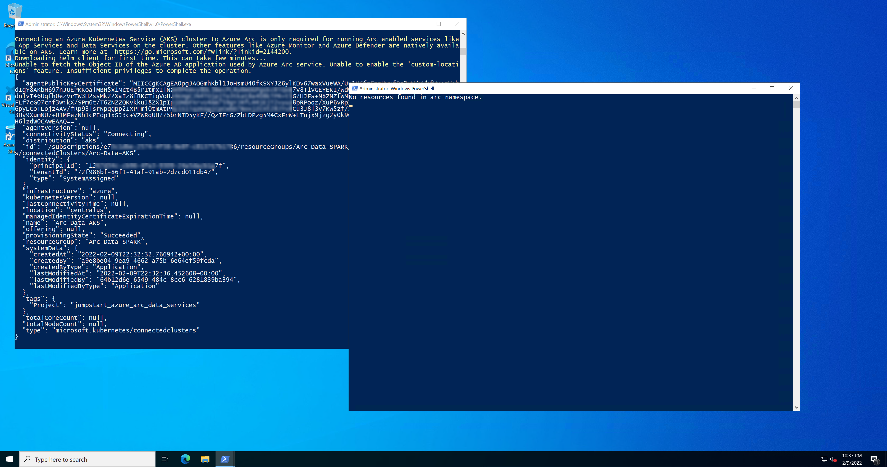

    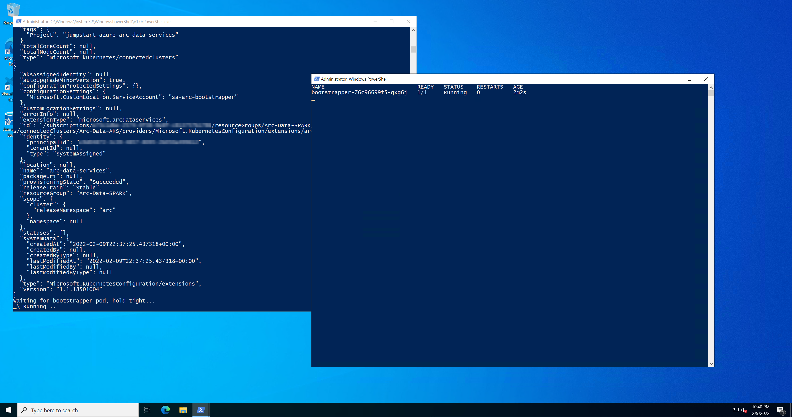

    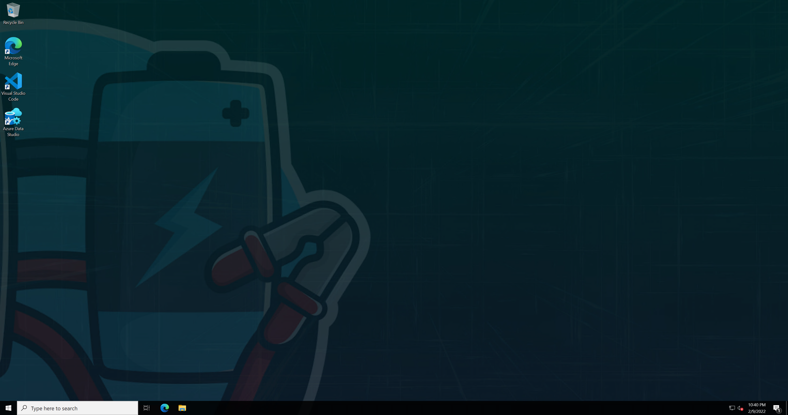

- Upon successful script run, the AKS cluster will get onboarded as an Azure Arc-enabled Kubernetes cluster a new Custom Location will be created. Both of these resource are required for the rest of the workshop.

    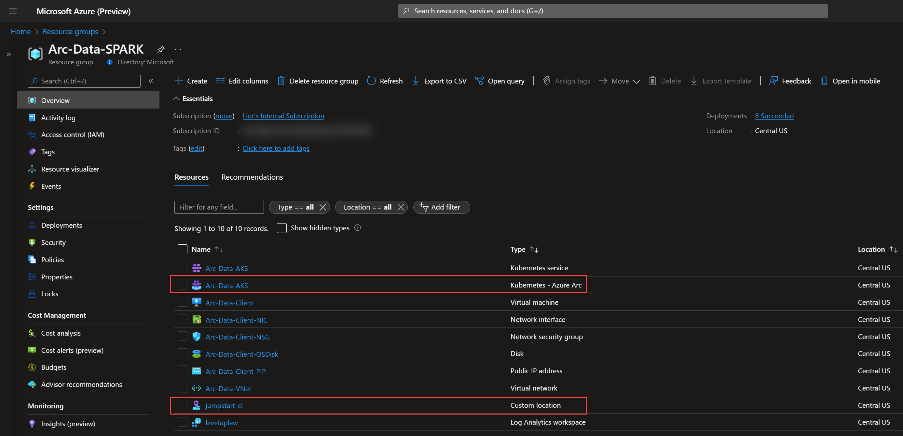

- In this scenario, the Azure Arc-enabled data services cluster extension was deployed and will be used throughout this workshop in order to deploy the data services infrastructure.

    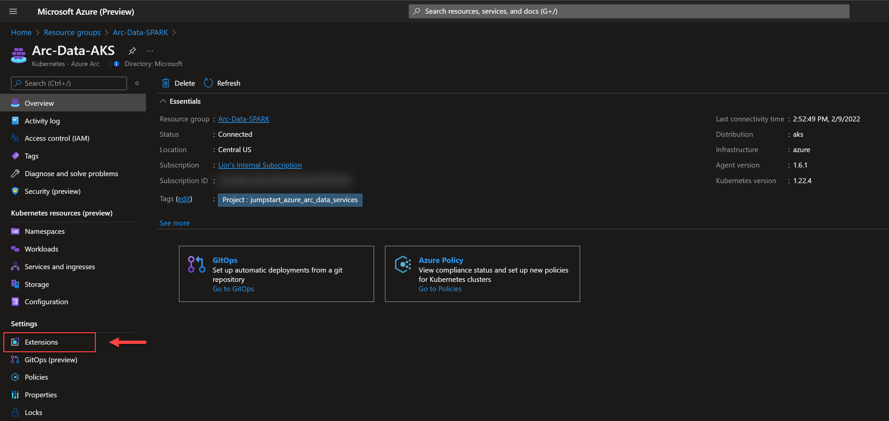

    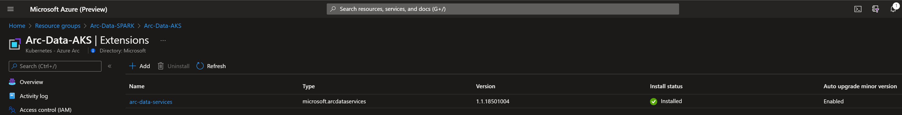

## Included environment variables

To help speed things up, as part of the automation, the below environment variables were infused to the Windows virtual machine.

```powershell
$Env:adminUsername
$Env:spnClientId
$Env:spnClientSecret
$Env:spnTenantId
$Env:subscriptionId
$Env:resourceGroup
$Env:azureLocation
$Env:workspaceName
$Env:clusterName
```

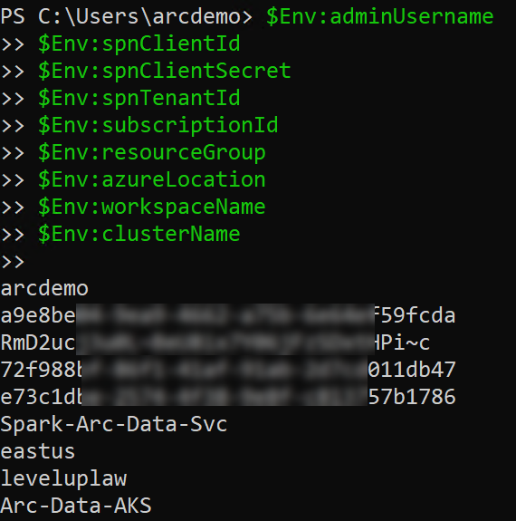

## Included tools and command line interfaces

Installed on the Windows virtual machine are the following tools and command line interfaces (CLI):

- Azure CLI
- kubectl
- Helm
- azdata CLI
- Azure Data Studio (ADS)
- SQL Server Management Studio (SSMS)
- Visual Studio Code
- SqlQueryStress
- AZCopy

## Cleanup

If you want to delete the entire environment, simply delete the deployment resource group from the Azure portal.

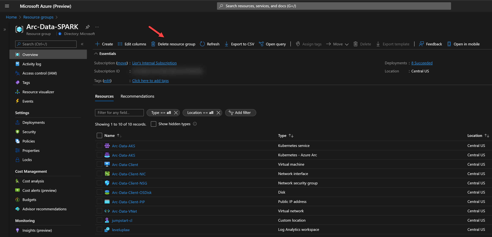
